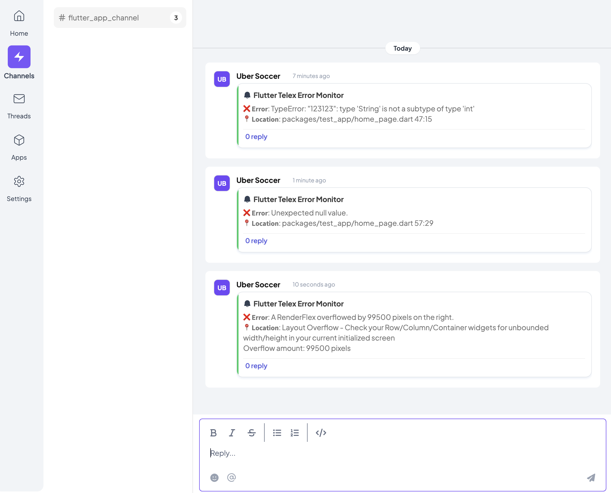

# Flutter Telex Error Monitor Backend

A FastAPI service that bridges Flutter applications and Telex channels for real-time error reporting.

## Overview

This backend service receives error data from Flutter applications (using the `flutter_telex_error_monitor` package) and forwards formatted error reports to Telex channels. It serves as the crucial middleware component in the error monitoring pipeline.

## Features

- Receives and processes error data from Flutter applications
- Formats error messages in a standardized, readable format
- Routes errors to the appropriate Telex channels via webhooks
- Supports custom application names for error source identification
- Provides consistent error reporting across multiple applications

## Error Example


## Telex Integration in Flutter

### Step 1: Set up Telex

Before installing the package, you need to set up a Telex channel:

1. Create an account with [telex.im](https://telex.im)
2. Click on the first tab with your initials to create an organization
3. Go to the "Channels" tab and add a channel
4. In your channel, click the arrow-down button beside your channel name and click on "Webhook Configuration"
5. Copy your webhook URL - you'll need this for initialization

### Step 2: Add the package to your Flutter project

Add the package to your `pubspec.yaml`:

```bash
flutter pub add flutter_telex_error_monitor
```

### Step 3: Initialize the error monitor

In your main.dart:

```dart
import 'package:flutter_telex_error_monitor/flutter_telex_error_monitor.dart';

void main() {
  // Initialize the error monitor before runApp
  FlutterTelexErrorMonitor.init(
    telexChannelWebhookUrl: "YOUR_TELEX_WEBHOOK_URL", // From Step 1
    appName: "YOUR_FLUTTER_APP_NAME",  // Optional
  );
  
  runApp(MyApp());
}
```

### Step 4: Android Configuration
- For Android apps, update your AndroidManifest.xml file located at android/app/src/main/AndroidManifest.xml.
Add the following inside the <application> tag:

```
<application
    android:enableOnBackInvokedCallback="true"
    ... >
</application>
```

## Test App Setup
For easier testing, i've provided a sample Flutter application that generates various types of errors:

Clone the test app repository:

``` bash
git clone https://github.com/EmmyAnieDev/flutter_apm-test_app.git
cd flutter_apm-test_app
flutter pub get
```

### Set up your Telex chanel webhook url configuration in main.dart:

```
dartCopyFlutterTelexErrorMonitor.init(
    appName: 'YOUR_APP_NAME',
    telexChannelWebhookUrl: 'YOUR_CHANNEL_WEBHOOK_URL'
);
```

```bash
Run the test app:
flutter run
```

- When you click on the counter button in the test app, different errors will be sent to your Telex channel based on the counter value. Each error will appear in your connected Telex channel with the error message and location details.

## Backend Setup

1. Clone this repository:
   ```bash
   https://github.com/telexintegrations/flutter_telex_error_monitor_backend.git
   cd flutter_telex_error_monitor_backend
   ```

2. Create a virtual environment (recommended):
   ```bash
   python -m venv venv
   source venv/bin/activate  # On Windows: venv\Scripts\activate
   ```

3. Install dependencies:
   ```bash
   pip install -r requirements.txt
   ```

4. Run the server:
   ```bash
   uvicorn main:app --reload
   ```

## Project Structure

```
test_app/
├── .github/
│   └── workflows/
│       └── keep_api_alive.yml    # GitHub Actions workflow
├── .venv/                        # Virtual environment
├── api/
│   ├── routes/
│   │   ├── integration.py        # Telex integration endpoints
│   │   └── submit_error.py       # Error submission handling
│   └── schema/
│       └── error_submission.py   # Error payload schema
├── screenshot/
│   └── telex_channel_screenshot.png
├── test/
│   └── main.py                   # Test files
├── README.md                     # Documentation
└── requirements.txt              # Dependencies
```

## API Reference

- 📌 Endpoint to send errors to THE Channel

   ```commandline
   POST https://fastapi-flutter-error-checker.onrender.com/api/v1/submit-error
   ```

- 📥 Request Body (JSON Format)

   ```commandline
   {
       "app_name": "My Test Flutter App",
       "telex_channel_webhook_Url": "YOUR_WEBHOOK_CHANNEL_URL",
       "error": "TypeError: Cannot read property 'length' of ",
       "location": "packages/myapp/lib/screens/home_screen.dart:42:10"
   }
   
   ```

- ✅ Expected Response

   ```commandline
   {
       "status": "success"
   }
   ```

- 📌 Error Format Displayed in Telex Channel

   ```commandline
   ❌ 𝗘𝗿𝗿𝗼𝗿: TypeError: Cannot read property 'length' of 
   📍 𝗟𝗼𝗰𝗮𝘁𝗶𝗼𝗻: packages/myapp/lib/screens/home_screen.dart:42:10
   ```

**Purpose:** Receives error data from Flutter applications and forwards it to Telex.

**Response**
- Status Code: 200
- Body: `{"status": "success"}` on successful processing

### Error Format
```
❌ 𝗘𝗿𝗿𝗼𝗿: {error_log.error}
📍 𝗟𝗼𝗰𝗮𝘁𝗶𝗼𝗻: {clean_location}
```

## Activating the Telex Integration

To use advanced features with error formatting settings:

1. Log in to your Telex organization
2. Navigate to the "Apps" tab in your organization sidebar
3. Search for "Flutter Telex Error Monitor" in the integrations marketplace
4. Click "Install" to add it to your organization
5. Navigate to the channel where you want to use error tracking
6. Click the channel settings (gear icon)
7. Select "Apps & Integrations"
8. Find "Flutter Telex Error Monitor" and toggle it on for this channel

### Configuring Integration Settings

Once activated, you can configure the integration settings:

1. Click on the "Flutter Telex Error Monitor" integration in your channel's integrations list
2. You'll see the following configuration options:
   - **Error Format Template**: Customize how errors appear in your channel
   - **Show Error Location**: Toggle whether to display file and line information

These settings allow you to:
- Adapt error messages to your team's preferences
- Control the level of detail shown in error reports
- Make error reporting consistent with your organization's standards

## Flow Diagram

```
Flutter App                 Backend Service               Telex
    |                             |                         |
    |-- Error occurs              |                         |
    |-- Captures details          |                         |
    |------- Send error --------->|                         |
    |                             |-- Formats error         |
    |                             |------- Forward -------->|
    |                             |                         |-- Displays in channel
```

## Contributing

Contributions are welcome! If you'd like to improve this project, feel free to open an issue or submit a pull request.

## License

This project is licensed under the MIT License.